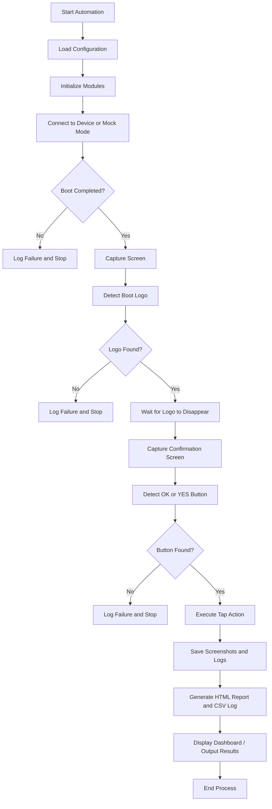
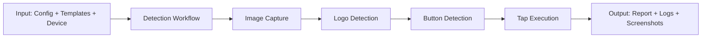

# LogoLocatorTool Project Documentation

## 1. Introduction
LogoLocatorTool is an automation framework designed to detect and validate automotive infotainment boot screens and confirmation buttons. The system is built in Python and is intended to automate the monitoring of device startup screens, identify key UI elements such as a boot logo and a confirmation button, and trigger a tap action when the button is detected. The project supports both real-device execution through ADB and mock-mode simulation for testing and development.

The tool is useful for validating infotainment systems where a boot logo appears at startup and a user confirmation screen later requires interaction. It captures screenshots, logs every stage of execution, and generates an HTML report that shows the progress and detected elements.

## 2. Project Objective
The primary objective of LogoLocatorTool is to automate the following tasks:

- connect to an Android or infotainment device through ADB,
- verify whether the device has completed booting,
- detect the OEM boot logo,
- wait until the logo disappears,
- detect an on-screen confirmation button such as OK or YES,
- simulate or send a tap to the identified button,
- generate a detailed execution report and logs.

The project also provides a dashboard for real-time monitoring and supports mock data so that the workflow can be tested without a live device.

## 3. Project Scope
The current implementation covers:

- device connection and boot verification,
- image capture from the display,
- logo detection using template matching and optional YOLO-based inference,
- button detection using template matching, OCR, or YOLO,
- tap execution through ADB,
- HTML reporting and CSV-based execution logging,
- live dashboard support for action logs.

## 4. System Architecture
The project is divided into several reusable modules, each responsible for one part of the automation workflow:

- main.py: entry point of the application. It loads configuration, initializes the components, runs the automation workflow, and produces the output report.
- modules/adb.py: manages communication with the device via ADB. It also provides a mock-state simulation mode for test environments.
- modules/capture.py: captures screenshots from the device display and saves them for later analysis.
- modules/logo_detector.py: detects the boot logo using image matching and optional object detection.
- modules/button_detector.py: identifies confirmation buttons using template matching, OCR, or YOLO.
- modules/tap.py: handles the tap execution logic and retries if needed.
- modules/reporter.py: creates annotated screenshots and generates the final HTML report.
- modules/logger.py: records execution events, writes logs, and saves data to CSV.
- live_dashboard.py: provides a live log window to monitor the process in real time.

This modular structure makes the project easy to maintain, test, and extend.

## 5. Project Plan
The project follows a clear execution plan:

1. Load configuration from config/config.json.
2. Initialize the logger, report generator, ADB manager, capturer, and detectors.
3. Connect to the device and verify that boot has completed.
4. Capture the screen and detect the boot logo.
5. Wait until the logo disappears.
6. Capture the disclaimer or confirmation screen.
7. Detect the relevant button (OK or YES).
8. Send a tap event to that button.
9. Record the result and generate HTML, CSV, and log outputs.

This plan ensures that interactions are performed only after the system reaches the correct stage of startup.

## 6. Execution Process
The execution flow begins in main.py. On startup, the application loads configuration values such as device ID, mock mode, thresholds, timeouts, button labels, and paths to templates and report folders. It then initializes the core modules needed for detection and reporting.

The first stage is connection and boot verification. The ADB manager tries to connect to the target device. In mock mode, it simulates the device state so the process can be demonstrated without the hardware present. If the device is not connected or if boot verification fails, the process stops early and records the failure reason.

Once the device is recognized as booted, the tool captures a screenshot and passes it to the logo detector. The detector checks for the boot logo using image-based template matching, and if a YOLO model is available, it can also detect the logo using object detection. If the logo is detected, the system continues. If the logo is not found within the defined timeout, the run is marked as failed.

The next stage checks whether the logo disappears. This is important because the system is waiting for the transition from the startup screen to the disclaimer or confirmation screen. If the logo remains on the screen beyond the timeout, the run is marked as failed.

After the logo disappears, the tool captures another screenshot and checks for confirmation buttons. The button detector uses a combination of template matching, OCR, and YOLO detection to locate buttons such as OK or YES. Once a button is found, the tap executor sends a click to the button center or a nearby candidate location inside the button box.

Finally, the execution result is written to logs and reports. The HTML report includes step-by-step information, images, and the overall status of the run.

## 7. Flowchart Representation
The execution of the project can be represented through the following flowchart, which shows the logical sequence from startup to final reporting.

### 7.1 Project Execution Flowchart

### 7.2 Process Summary Diagram

## 8. Inputs and Outputs
### Inputs
- configuration values from config/config.json,
- image templates for logo and buttons,
- mock screen images in the scratch folder,
- device screen image data from ADB,
- optional YOLO model files.

### Outputs
- screenshots stored in the screenshots folder,
- HTML report in the reports folder,
- CSV execution log in the reports folder,
- plain text log file in the logs folder,
- live-dashboard updates during execution.

## 9. Key Deliverables
The project produces the following results during each run:

- a detailed execution timeline,
- annotated screenshots with detected objects,
- the final status of the automation run,
- evidence of the device interaction process,
- a permanent log trail for troubleshooting and review.

## 10. Advantages of the Project
- modular and easy to understand,
- supports both real hardware and mock testing,
- provides visual reporting for each step,
- reusable logic for logo and button detection,
- suitable for automation and validation scenarios.

## 11. Limitations and Future Improvements
The current implementation is effective for controlled environments, but there are opportunities for improvement:

- add better support for multiple device models and screen resolutions,
- improve OCR reliability for different fonts and lighting conditions,
- integrate a more advanced computer vision pipeline for robust detection,
- extend the tool to support more UI elements and dynamic screens,
- add CI/CD automation and test coverage for the modules.

## 12. Conclusion
LogoLocatorTool is a practical automation solution for validating startup screens and confirmation actions on infotainment systems. Its modular design, mock-mode support, and rich reporting make it useful for both development and demonstration purposes. The project combines device interaction, image processing, and reporting into one streamlined workflow, making it a strong foundation for further expansion.
